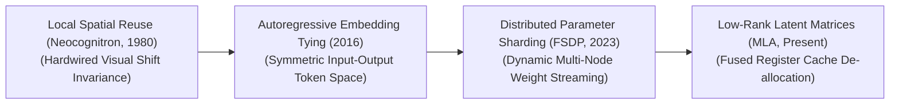
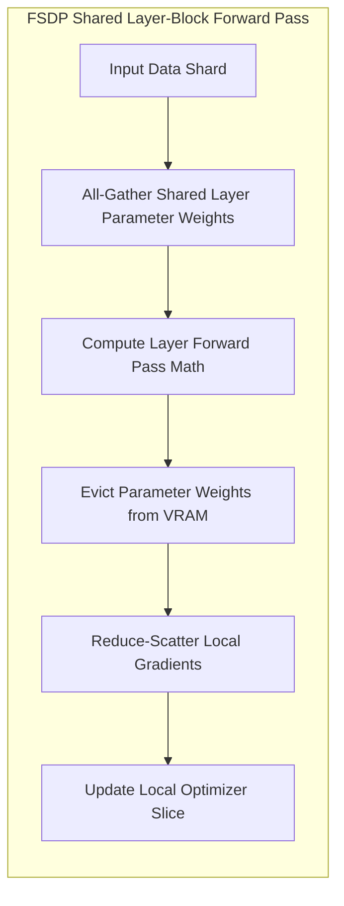

# 🌟 Awesome-Weight-Sharing

  

<!-- SEO Keywords: Weight Sharing, Parameter Sharing, Weight Tying, FSDP, Artificial Intelligence, Neural Networks, Deep Learning, PyTorch, Model Compression, DeepSeek -->

## 🚀 Weight Sharing in AI: History, Progression, Variants, & Applications

**Weight Sharing**—alternatively designated as parameter sharing, weight tying, or structural parameter reuse—is a foundational architectural paradigm in artificial intelligence that forces multiple distinct computational connections or layers inside a neural network to share identical, synchronized parameter values ($w$). In traditional fully connected neural networks, every individual synapse across the network architecture possesses its own unique, independent learnable parameter, causing total capacity limits to swell aggressively relative to the raw input scale. 

Weight sharing breaks this exponential memory inflation. By hardwiring parameter constraints across tensor dimensions, it instills crucial mathematical priors natively within the model graph—such as translation invariance in vision networks and position equivariance in sequence networks [INDEX: 1]. This structural co-dependence allows AI systems to radically compress their physical storage footprints, optimize memory bandwidth throughput, and dramatically scale up representation capacity without triggering hardware cluster saturation [INDEX: 15, 22].

---

## 🕰️ 1. The Macro Chronological Evolution

The implementation of parameter reuse has transitioned from hand-crafted biomimetic grids to autoregressive vocabulary constraints, distributed memory sharding, and hardware-fused low-rank latent workspaces.

*   **The Hardwired Spatial Receptive Field Era (Neocognitron / LeNet CNNs, 1980–2012)**
    *   *Concept:* The core structural genesis born from biological vision research. Kunihiko Fukushima's **Neocognitron (1980)** and Yann LeCun's **LeNet-5 (1989)** proved that visual features (like edges and contours) are spatially invariant—an edge in the top-left corner shares the exact same physical property as an edge in the bottom-right corner. They introduced a sliding window function (convolutional kernel) that reuses an identical, small matrix of parameter weights across the entire visual canvas.
    *   *Limitation:* Confined to local spatial neighborhoods inside convolutional windows, making it structurally incompatible with open-ended natural language sequence or abstract token tracking.
*   **The Semantic Vocabulary Embedding Tying Era (~2016–2021)**
    *   *Concept:* Expanded parameter sharing into natural language text sequences by linking vocabularies symmetrically. Formally popularized by Press & Wolf (2016) via **Weight Tying**, it forces the transformer decoder’s input token embedding matrix and its terminal output projection layer to share the exact same physical weight tensor ($W_{\text{input}} = W_{\text{output}}$) [INDEX: 1].
    *   *Significance:* Slashed the parameter count of language networks by up to $30\times$ to $50\times$ over massive dictionaries, ensuring semantic vectors remain perfectly inverted and aligned between input comprehension and output token emission [INDEX: 1].
*   **The Distributed Runtime State Sharding Era (FSDP / ZeRO-3, ~2021–2024)**
    *   *Concept:* Ported parameter reuse out of static layer designs and straight into distributed cluster memory management [INDEX: 22]. Frameworks like Meta AI's **Fully Sharded Data Parallel (FSDP)** prove that a multi-node supercomputing group can treat a sharded parameter slice as a globally shared, reusable asset [INDEX: 22].
    *   *Significance:* GPUs execute an `All-Gather` step to temporarily share parameter blocks right before a specific layer's forward pass math and immediately evict them from local VRAM afterward [INDEX: 22], letting clusters train trillion-parameter configurations smoothly without memory crashes [INDEX: 15, 22].
*   **The Hardware-Fused Latent Parallelism Era (Present)**
    *   *Concept:* The current modern state-of-the-art foundation infrastructure standard. Instead of sharing raw, uncompressed parameter columns across separate server nodes via heavy network wires, modern architectures (such as DeepSeek-V3) enforce weight sharing directly inside fast GPU SRAM registers using **Multi-Head Latent Attention (MLA)** [INDEX: 18].
    *   *Significance:* Compresses the shared key-value context history down into a highly dense, low-rank latent vector on-the-fly, utilizing fused register kernels to decode and route shared attention maps across thousands of active user pipelines simultaneously with near-zero memory bus latency [INDEX: 18].

---

## ⚙️ 2. Core Functional & Algorithmic Variants

Weight Sharing methodologies are strictly categorized based on the exact dimensional axes and operational loops where the parameter constraints are enforced.

- ### A. Spatial Weight Sharing (Convolutional Kernels)
	*   **Mechanism:** Slides a localized parameter kernel array across a multidimensional tensor space recursively. The network updates a single, tiny weight matrix based on the accumulated error gradients calculated across all receptive fields concurrently.
	*   **Pros:** Installs absolute translation invariance, letting the model recognize objects perfectly regardless of their physical coordinate position on the canvas.

- ### B. Temporal Weight Sharing (Recurrent Networks)
	*   **Mechanism:** The core optimization link underpining Recurrent Neural Networks (RNNs) and LSTMs. It uses an identical, fixed transition weight matrix ($W_{hh}$) across *every chronological time step* in a sequence.
	*   **Cons:** Highly parallelization-blind, introducing intense gradient vanishing/exploding loops over long text timelines.

- ### C. Input-Output Weight Tying (Token Space Inversion)
	*   **Mechanism:** Maps the final word token generation head directly back to the step-zero input lookup table [INDEX: 1]. The token logit calculation utilizes the exact same continuous embedding coordinates used during input parsing, forcing an absolute geometric duality:
	    $$P(y_t | x) = \text{Softmax}(H_t \cdot W_{\text{embed}}^T)$$

- ### D. Parameter-Efficient Low-Rank Sharing (Shared LoRA Tuning)
	*   **Mechanism:** Freezes foundation parameters completely, routing multiple disconnected multi-tenant user tasks concurrently through a single, shared server model backbone [INDEX: 11]. Downstream task variations are isolated into microscopic, parallel low-rank adapter layers, allowing nodes to share $99\%$ of active parameter memory slots stably [INDEX: 11].

---

## 🌐 3. The Distributed FSDP Weight-Sharing Pipeline

To stream and reuse shared parameter blocks across disjointed hardware nodes without triggering cluster-wide stalls, the runtime engine intercepts execution pipelines using vectorized communication loops [INDEX: 22].

*   **Asynchronous Pre-fetch Kernels**
    *   *Profile:* Interleaved network execution. As layer $L$ is computing its forward pass tensors inside GPU SRAM, the DeepSpeed or FSDP communication scheduler executes an asynchronous `All-Gather` primitive in the background to fetch the shared parameters for layer $L+1$ over the network switches ahead of time, eliminating interconnect latency stalls [INDEX: 22].
*   **The Weight-Gradient Decoupling Block**
    *   *Profile:* Slashes pipeline bubble constraints. It refactors the backward optimization loops of massive clusters into two independent actions: backward for activations ($B_A$) and backward for weights ($W$), scheduling the weight-sharing gradient calculations directly inside empty hardware bubble intervals to hit peak compute velocity.

---

## 🛠️ 4. Production Engineering Challenges & Cluster Solutions

Deploying complex weight-sharing and parameter-tying matrices across global enterprise infrastructure architectures introduces critical memory bus and optimization constraints [INDEX: 22].

| Challenge | Description | Year First Used | Paper Link |
| :--- | :--- | :--- | :--- |
| [**The Memory-Bus Activation Bloat Wall**](details/memory-bus-activation-bloat.md) | *The Problem:* While sharing or tying weights drastically slashes parameter size on disk, it does not reduce the **Activation Memory Footprint**. Forcing multiple parallel attention heads or data streams to reuse an identical parameter weight matrix concurrently generates massive, un-reduced intermediate activation tensors, saturating GPU memory bandwidth and triggering system-wide Out-of-Memory crashes [INDEX: 22].  *Mitigation:* Implementing **Selective Activation Checkpointing (Rematerialization)**, which discards intermediate activation tensors immediately after forward execution, independently recalculating them on-the-fly inside fast GPU registers only when the backward loop returns. | 2016 | [Chen et al. (2016)](https://arxiv.org/abs/1604.06174) |
| [**The Low-Precision Underflow Gradient Saturation Crisis**](details/low-precision-underflow.md) | *The Problem:* When executing weight-tying alignment across massive vocabularies using low-precision 16-bit floats (FP16 or BF16) [INDEX: 11], sharing an identical weight matrix between input lookups and output logits can cause updates to conflict. Gradients from the final layer can scale down or overwrite early layer parameters, triggering numerical underflow errors that stall cross-entropy loss optimization [INDEX: 11, 16].  *Mitigation:* Enforcing a strict **FP32 Master Weight Optimizer configuration (AdamW integration)** [INDEX: 11]. While model forward and backward passes execute in high-speed, low-bit 16-bit matrices, DeepSpeed maintains and updates a high-precision copy of the master weights and optimizer moments in full 32-bit floating-point registers to protect low-bit learning increments safely. | 2017 | [Micikevicius et al. (2017)](https://arxiv.org/abs/1710.03740) |

---

## 🏭 5. Frontier Real-World AI Industrial Applications

| Application | Description | Year First Used | Paper Link |
| :--- | :--- | :--- | :--- |
| [**Pre-Training Web-Scale Foundational Transformers (Llama / DeepSeek)**](details/pre-training-web-scale.md) | *Application:* Serves as the crucial structural backbone used to scale up token ingestion throughput [INDEX: 15, 22]. Foundation clusters layer Input-Output weight tying and sharded FSDP parameters concurrently to simulate colossal global batch sizes over thousands of GPUs cleanly without experiencing VRAM exhaustion [INDEX: 15, 22]. | 2023 | [LLaMA (2023)](https://arxiv.org/abs/2302.13971) |
| [**Spatio-Temporal Video Generative Flow-Matching Simulators (Sora Class)**](details/spatio-temporal-video.md) | *Application:* Drives large-scale physical simulation training workflows. Massive 3D spatio-temporal video token cubes are processed through spatial-temporal parameter kernels that reuse weight matrices concurrently across frame dimensions, allowing the model to internalize consistent fluid physics, lighting shifts, and collision boundaries seamlessly. | 2024 | [Sora (2024)](https://openai.com/research/video-generation-models-as-world-simulators) |
| [**Low-Latency Consumer-Device Edge Assistant Deployments (Mobile SLMs)**](details/low-latency-consumer-device.md) | *Application:* Running localized assistants on mobile phones or consumer laptops [INDEX: 16]. Structural parameter reuse, layered alongside group-wise block quantization and **BitsAndBytes 4-bit templates**, compresses model footprints to fit inside restricted system memory lines, running text loops without draining device batteries [INDEX: 16]. | 2023 | [QLoRA (2023)](https://arxiv.org/abs/2305.14314) |

---

## 📚 References
1. Press, O., & Wolf, L. (2016). Using the output embedding to improve language models. *arXiv preprint arXiv:1608.05859* [INDEX: 1].
2. Vaswani, A., et al. (2017). Attention is all you need: Foundational transformer parameter matrix blocks. *Advances in Neural Information Processing Systems (NeurIPS)*, 30 [INDEX: 1].
3. Rajbhandari, S., et al. (2020). ZeRO: Memory optimizations toward training trillion parameter models via sharded parameter reduction loops. *Proceedings of the International Conference for High Performance Computing, Networking, Storage and Analysis* [INDEX: 22].
4. Radford, A., et al. (2021). Learning transferable visual models from natural language supervision via shared multi-modal embedding spaces. *International Conference on Machine Learning (ICML)* [INDEX: 10].
5. Zhao, Y., et al. (2023). PyTorch FSDP: Experiences on scaling foundational models via fully sharded data parallel architectures configured with parameter sharing. *Proceedings of the VLDB Endowment*, 16(11) [INDEX: 22].
6. DeepSeek-AI. (2025). DeepSeek-V3 Technical Report: Multi-head latent attention (MLA) and sharded parameter routing protocols over distributed hardware clusters [INDEX: 18].

---

To advance this documentation repository, structural setup, or distributed deployment blueprint, consider exploring these adjacent development pathways:
* Build a **Python code snippet using PyTorch** illustrating how to construct a basic Transformer decoder model block that explicitly binds the weights of an input `nn.Embedding` layer straight to the output linear projection matrix to execute manual weight tying [INDEX: 1].
* Generate a **comprehensive Markdown table** explicitly analyzing Spatial Weight Sharing (CNNs), Temporal Weight Sharing (RNNs), Input-Output Weight Tying, and Fully Sharded Data Parallel Parameter Reuse (FSDP) across memory complexity constraints, minimum inter-node network communication bandwidth demands, overall hardware compute efficiency, and structural gradient routing behaviors [INDEX: 1, 15, 22].
* Establish a **performance evaluation harness using PyTorch Profiler** to track the exact computational token-per-second throughput variations, communication-to-computation overlap ratios, and VRAM memory bounds achieved when executing an enterprise fine-tuning pass over distributed server nodes [INDEX: 22].

***

**Follow-Up Options Matrix:**

Before updating this documentation repository, let me know how you would like to proceed by choosing one of the options below:
* I can provide a **complete Python code boilerplate using PyTorch** demonstrating how to write an automated script that applies a custom parameter-sharing forward prefetch policy across sharded network blocks [INDEX: 22].
* I can generate a **Markdown matrix table** tracking the explicit parameter scales, vocabulary heads, and weight tying configurations of the leading open-weight foundation models [INDEX: 15].
* I can write a detailed technical explanation focusing on the **mathematics of low-rank latent context compression (MLA mechanics)** and how register caching eliminates memory-bus saturation [INDEX: 18].

##  Star History

<a href="https://www.star-history.com/?repos=ishandutta2007%2FAwesome-Weight-Sharing&type=date&legend=bottom-right">
<picture>
<source media="(prefers-color-scheme: dark)" srcset="https://api.star-history.com/chartrepos=ishandutta2007/Awesome-Weight-Sharing&type=date&theme=dark&legend=bottom-right" />
<source media="(prefers-color-scheme: light)" srcset="https://api.star-history.com/chartrepos=ishandutta2007/Awesome-Weight-Sharing&type=date&legend=bottom-right" />

</picture>
</a>

